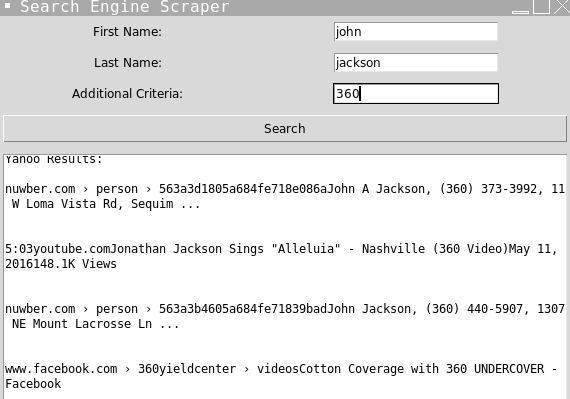

PeopleScraper is a Python program that enables users to search multiple search engines for a given first name, last name, and additional criteria. It provides a graphical user interface (GUI) for easy interaction and displays clickable links to the search results.

Features

Supports searching on various search engines, including Google, DuckDuckGo, Brave, Yahoo, and AOL.
User-friendly GUI for input and displaying results.
Clickable titles in the results for convenient access to corresponding links.
Provides feedback during the search process.

Installation

Clone the repository:
bash

git clone https://github.com/HelloByeLetsNot/PeopleScraper.git
Navigate to the project directory:
bash

cd PeopleScraper
Install the required Python libraries:

pip install -r requirements.txt
Usage

Run the program:
python main.py

Enter the first name, last name, and additional criteria in the respective entry fields.
Click the "Search" button to initiate the search process.
The search results will be displayed in the text area below the input fields. Click on the titles to open the corresponding links.

Contributing
Contributions are welcome! If you'd like to contribute to this project, please follow these steps:

Fork the repository.
Create your feature branch:
css

git checkout -b feature/YourFeature
Commit your changes:
sql

git commit -am 'Add some feature'
Push to the branch:
perl

git push origin feature/YourFeature
Open a pull request.

License
This project is licensed under the MIT License. See the LICENSE file for details.
